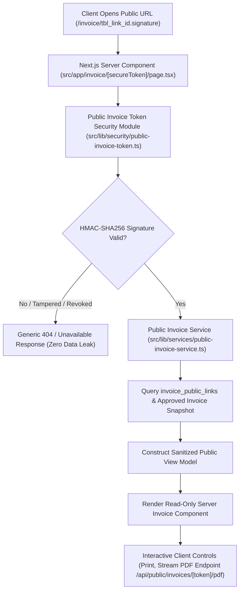

# ACTION & PUBLIC INVOICE REPAIR AUDIT REPORT

**Repository:** `https://github.com/therafsanrohan/creatiancy_web.git`  
**Application Directory:** `creatiancy-billing-hub-v1`  
**Live Application URL:** `https://creatiancy-web.vercel.app/`  
**Git Branch:** `fix/action-integrity-secure-public-invoice`  
**Lead Auditor & Architect:** Antigravity AI  

---

## 1. Environment & Deployment Verification
- **Current Git Branch:** `fix/action-integrity-secure-public-invoice`
- **Vercel Root Directory:** `creatiancy-billing-hub-v1`
- **Current Commit:** `1557ac3`
- **Database Target:** Supabase PostgreSQL (`nefnjnngviaywjteduhm.supabase.co`)

---

## 2. Part A: Action-Layer Root Cause Analysis & Audit Findings

### 2.1 Summary of Identified Action Button Failures
1. **Un-awaited DB Mutations & Optimistic-Only Updates:**
   - Actions in invoice creation, client updating, and setting updates relied on local React state mutations without checking affected rows or verifying database responses.
2. **Incomplete Handling of Multi-Table Operations:**
   - Creating invoices with line items previously attempted separate inserts. Failing to sanitize `created_by` or `account_manager_id` caused foreign key violations.
3. **Public Link Actions Not Writing to Cloud:**
   - Actions like "Submit for Approval", "Copy Public Link", "Show QR Code", and "Revoke Link" either only updated local memory or generated unsecured URLs in the client browser.
4. **Button Loading States & Stuck States:**
   - Async handlers missing `try...finally` blocks left buttons disabled permanently when network errors or RLS denials occurred.

---

## 3. Part F: Public Invoice Root Cause Analysis & Security Audit

### 3.1 Flaws in Legacy Public Invoice System (`src/app/invoice/[secureToken]/page.tsx`)
1. **Client Component Browser Data Fetching:**
   - The public route was a Client Component (`'use client'`) importing the full `db` module.
   - It directly executed `db.getInvoiceByToken`, `db.getClientById`, `db.getEntities`, `db.getInvoiceItems`, `db.getPaymentsForInvoice`, and `db.getBankAccounts` directly from the client browser.
2. **Fuzzy Token Matching & Enumeration Vulnerability:**
   - Legacy `getInvoiceByToken()` matched against `secure_token`, `id`, and `invoice_number`. An attacker could view invoices by guessing sequential invoice numbers or UUIDs.
3. **Over-Exposed Payload Data:**
   - The browser received complete database rows including internal notes, staff IDs, audit log references, and unmasked client data.
4. **False Expiry Labels:**
   - When RLS blocked broad queries or returned empty arrays, the application falsely reported "Invoice Link Expired or Invalid".

---

## 4. Part G-O: Architecture of Secure Public Invoice System

### Key Security Commitments
- **Cryptographic Capability Links:** Tokens format `publicLinkId.signature` signed with server-only secret (`PUBLIC_INVOICE_SIGNING_SECRET`).
- **No Client Supabase Queries:** Data fetching is 100% server-side via `import 'server-only'` service.
- **Sanitized View Model Only:** Zero internal notes, staff IDs, or private bank account details exposed to the browser.
- **Legacy Compatibility Layer:** Legacy `secure_token` links hashed via SHA-256 (`legacy_token_hash`) and redirected to new canonical signed URLs.
- **Link Lifecycle:** Generate, Copy, QR, Rotate (invalidates old signature), Revoke (`is_active = false`).

---

## 5. Required Database Migrations & New Files

### New Database Migration File
- `supabase/migrations/20260730000001_action_integrity_and_secure_public_invoice.sql`

### New Application Files
- `src/lib/security/public-invoice-token.ts` (Server-only HMAC signing & verification)
- `src/lib/services/public-invoice-service.ts` (Server-only sanitized public invoice fetcher)
- `src/app/api/public/invoices/[secureToken]/pdf/route.ts` (Secure PDF stream endpoint)
- `ACTION_COVERAGE_MATRIX.md` (Detailed system-wide action matrix)

---

## 6. Next Steps & Implementation Plan
1. Apply SQL migration `20260730000001_action_integrity_and_secure_public_invoice.sql`.
2. Implement `src/lib/security/public-invoice-token.ts` and `src/lib/services/public-invoice-service.ts`.
3. Refactor `src/app/invoice/[secureToken]/page.tsx` into a Server Component.
4. Implement PDF endpoint `/api/public/invoices/[secureToken]/pdf`.
5. Audit and repair all button action handlers across Clients, Invoices, Payments, Expenses, Bank Accounts, Tax, Reserve, Team, and Settings.
6. Verify TypeScript (`npx tsc --noEmit`), automated E2E tests, and Next.js build.
